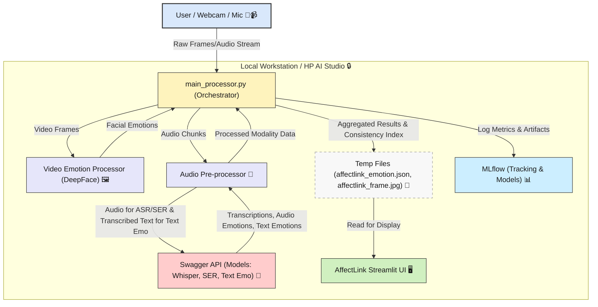

# AffectLink: Multimodal Emotion Consistency Tracking for Telehealth

**AffectLink** is an AI-powered system that analyzes a patient’s emotional state by comparing facial expressions with vocal tone. It helps identify inconsistencies, fatigue, or stress — providing clinicians with real-time and retrospective emotional insights during virtual sessions.

## 🔍 What It Does
- 🎙️ Detects speech-based emotional tone using Whisper + emotion classification.
- 🎥 Detects facial emotion using real-time video feed.
- 🧩 Compares the two to assess emotional consistency or mismatch.
- 📈 Tracks mood and stress markers over time to surface potential concerns.
- 🧑‍⚕️ Built for clinicians and therapists using telehealth platforms.

## 🚀 Features
- Multimodal emotional analysis (audio + video).
- Session-level emotional summary reports.
- Local-first privacy-preserving deployment.
- Optional integration with MLflow and Swagger.

## 🛠️ Built With
- Python
- OpenCV, DeepFace, Whisper
- Streamlit / Flask
- MLflow
- HP AI Studio

## 🧪 Setup Instructions
```bash
git clone https://github.com/kingkw1/AffectLink.git
cd AffectLink
pip install -r requirements.txt
python app/main.py
```

## 📄 Demo Video
- [Link to Demo Video Here]

## 📚 Documentation

### Architecture


- [Demo Scenario Script](docs/demo_script.md)

## ✨ Future Work
- Add sentiment summarization of conversation.
- Improve emotion classification with lightweight transformers.
- Extend to triadic (3+ participants) sessions.

## 📜 License
MIT License

---
Built with 💬 by Kevin King for the HP AI Studio & NVIDIA Developer Challenge.